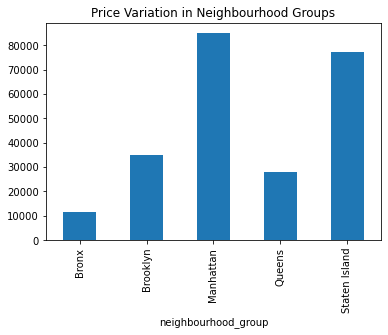
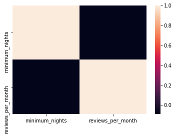
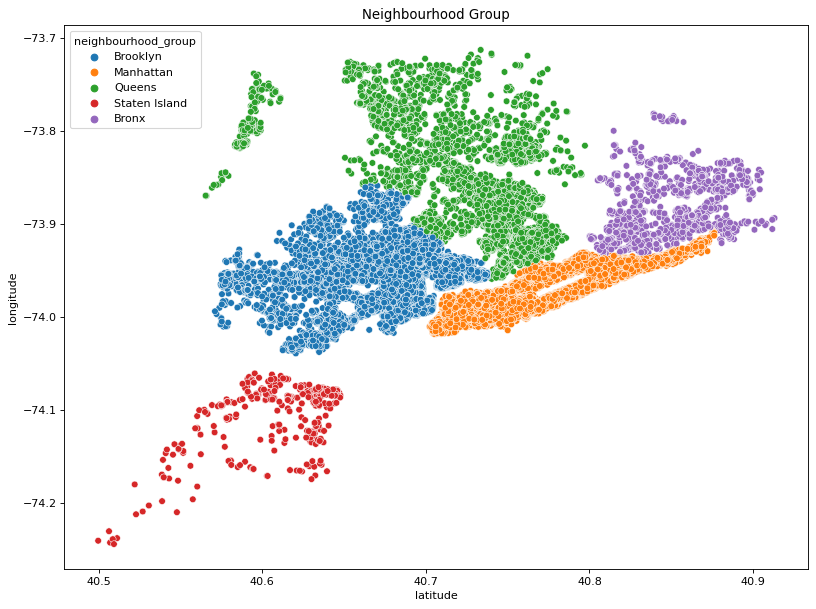
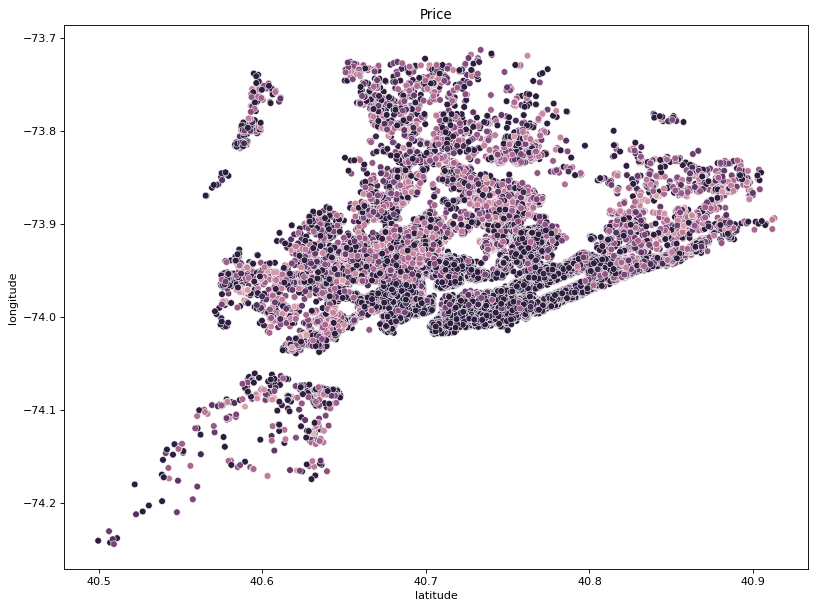
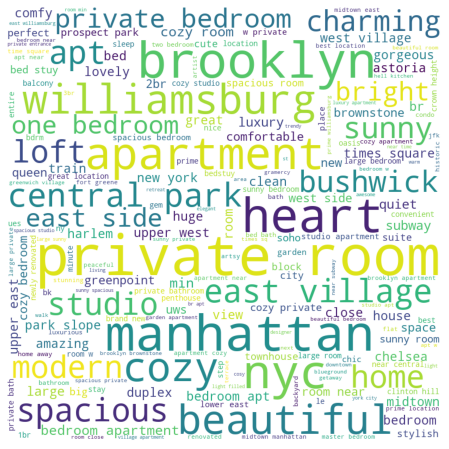
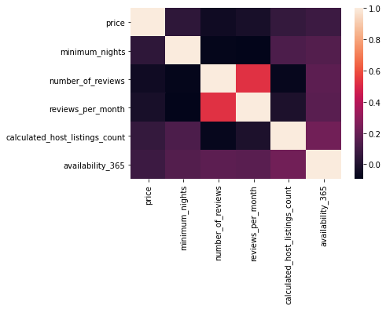
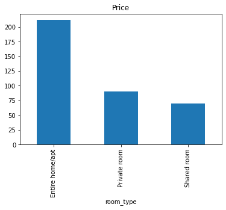
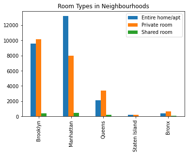

# Airbnb Exploratory Data Analysis

## Introduction
In the digital age, most human activities are recorded in application usage. In this study, we use the data set scraped from Airbnb to investigate customer behaviour and the property market.


```python
import pandas as pd
import matplotlib.pyplot as plt
import numpy as np
import seaborn as sns
from wordcloud import WordCloud
```


```python
airbnb = pd.read_csv("AB_NYC_2019.csv")
airbnb.head()
```


<div>
<style scoped>
    .dataframe tbody tr th:only-of-type {
        vertical-align: middle;
    }

    .dataframe tbody tr th {
        vertical-align: top;
    }

    .dataframe thead th {
        text-align: right;
    }
</style>
<table border="1" class="dataframe">
  <thead>
    <tr style="text-align: right;">
      <th></th>
      <th>id</th>
      <th>name</th>
      <th>host_id</th>
      <th>host_name</th>
      <th>neighbourhood_group</th>
      <th>neighbourhood</th>
      <th>latitude</th>
      <th>longitude</th>
      <th>room_type</th>
      <th>price</th>
      <th>minimum_nights</th>
      <th>number_of_reviews</th>
      <th>last_review</th>
      <th>reviews_per_month</th>
      <th>calculated_host_listings_count</th>
      <th>availability_365</th>
    </tr>
  </thead>
  <tbody>
    <tr>
      <th>0</th>
      <td>2539</td>
      <td>Clean &amp; quiet apt home by the park</td>
      <td>2787</td>
      <td>John</td>
      <td>Brooklyn</td>
      <td>Kensington</td>
      <td>40.64749</td>
      <td>-73.97237</td>
      <td>Private room</td>
      <td>149</td>
      <td>1</td>
      <td>9</td>
      <td>2018-10-19</td>
      <td>0.21</td>
      <td>6</td>
      <td>365</td>
    </tr>
    <tr>
      <th>1</th>
      <td>2595</td>
      <td>Skylit Midtown Castle</td>
      <td>2845</td>
      <td>Jennifer</td>
      <td>Manhattan</td>
      <td>Midtown</td>
      <td>40.75362</td>
      <td>-73.98377</td>
      <td>Entire home/apt</td>
      <td>225</td>
      <td>1</td>
      <td>45</td>
      <td>2019-05-21</td>
      <td>0.38</td>
      <td>2</td>
      <td>355</td>
    </tr>
    <tr>
      <th>2</th>
      <td>3647</td>
      <td>THE VILLAGE OF HARLEM....NEW YORK !</td>
      <td>4632</td>
      <td>Elisabeth</td>
      <td>Manhattan</td>
      <td>Harlem</td>
      <td>40.80902</td>
      <td>-73.94190</td>
      <td>Private room</td>
      <td>150</td>
      <td>3</td>
      <td>0</td>
      <td>NaN</td>
      <td>NaN</td>
      <td>1</td>
      <td>365</td>
    </tr>
    <tr>
      <th>3</th>
      <td>3831</td>
      <td>Cozy Entire Floor of Brownstone</td>
      <td>4869</td>
      <td>LisaRoxanne</td>
      <td>Brooklyn</td>
      <td>Clinton Hill</td>
      <td>40.68514</td>
      <td>-73.95976</td>
      <td>Entire home/apt</td>
      <td>89</td>
      <td>1</td>
      <td>270</td>
      <td>2019-07-05</td>
      <td>4.64</td>
      <td>1</td>
      <td>194</td>
    </tr>
    <tr>
      <th>4</th>
      <td>5022</td>
      <td>Entire Apt: Spacious Studio/Loft by central park</td>
      <td>7192</td>
      <td>Laura</td>
      <td>Manhattan</td>
      <td>East Harlem</td>
      <td>40.79851</td>
      <td>-73.94399</td>
      <td>Entire home/apt</td>
      <td>80</td>
      <td>10</td>
      <td>9</td>
      <td>2018-11-19</td>
      <td>0.10</td>
      <td>1</td>
      <td>0</td>
    </tr>
  </tbody>
</table>
</div>


## Data Cleaning

We see that only 4 columns have null data. Since name and last_review are not that useful in data mining, we can safely drop them. For reviews_per_month, we can assign mean values to the null data.


```python
airbnb.isnull().sum()
```


    id                                    0
    name                                 16
    host_id                               0
    host_name                            21
    neighbourhood_group                   0
    neighbourhood                         0
    latitude                              0
    longitude                             0
    room_type                             0
    price                                 0
    minimum_nights                        0
    number_of_reviews                     0
    last_review                       10052
    reviews_per_month                 10052
    calculated_host_listings_count        0
    availability_365                      0
    dtype: int64


```python
airbnb = airbnb.drop(['host_name', 'last_review'], axis=1)
```


```python
airbnb['reviews_per_month'].fillna(value=airbnb['reviews_per_month'].mean(), inplace=True)
```

We need not deal with null data in property name because it is trivial.


```python
airbnb.isnull().sum()
```


    id                                 0
    name                              16
    host_id                            0
    neighbourhood_group                0
    neighbourhood                      0
    latitude                           0
    longitude                          0
    room_type                          0
    price                              0
    minimum_nights                     0
    number_of_reviews                  0
    reviews_per_month                  0
    calculated_host_listings_count     0
    availability_365                   0
    dtype: int64


## Prices vs Neighbourhood

In this section we investigate the average price of the properties, in particularly the cheapest and the priciest neighbourhood.


```python
# Cheapest
airbnb.groupby('neighbourhood').mean().sort_values(by='price').head()['price']
```


    neighbourhood
    Bull's Head    47.333333
    Hunts Point    50.500000
    Tremont        51.545455
    Soundview      53.466667
    New Dorp       57.000000
    Name: price, dtype: float64


```python
# Most expensive
airbnb.groupby('neighbourhood').mean().sort_values(by='price', ascending=False).head()['price']
```


    neighbourhood
    Fort Wadsworth    800.000000
    Woodrow           700.000000
    Tribeca           490.638418
    Sea Gate          487.857143
    Riverdale         442.090909
    Name: price, dtype: float64


We would also like to examine the variation of prices within each neighbourhood group.


```python
airbnb.groupby('neighbourhood_group').var()['price'].plot.bar(title='Price Variation in Neighbourhood Groups')
```


    <AxesSubplot:title={'center':'Price Variation in Neighbourhood Groups'}, xlabel='neighbourhood_group'>





##  Pearson correlation analysis

We make a hypothesis that minimum nights required is negatively correlated to the number of bookings, as there poses a threshold to most customers, which is in turn reflected in the number of reviews per month. The correlation matrix confirms our hypothesis. 


```python
corr = airbnb[['minimum_nights', 'reviews_per_month']].corr()
print(corr)
```

                       minimum_nights  reviews_per_month
    minimum_nights           1.000000          -0.091942
    reviews_per_month       -0.091942           1.000000
    

We can also visualise the correlation in a correlation matrix.


```python
sns.heatmap(corr, xticklabels=corr.columns, yticklabels=corr.columns)
```


    <AxesSubplot:>





## Location

We can plot location of property against neighbourhood group and price to visualise their relation.


```python
plt.figure(figsize=(12, 9), dpi=80)
sns.scatterplot('latitude', 'longitude', data=airbnb, hue='neighbourhood_group').set(title='Neighbourhood Group')
```

    C:\Users\AU YONG Chun Sang\miniconda3\lib\site-packages\seaborn\_decorators.py:36: FutureWarning: Pass the following variables as keyword args: x, y. From version 0.12, the only valid positional argument will be `data`, and passing other arguments without an explicit keyword will result in an error or misinterpretation.
      warnings.warn(
    


    [Text(0.5, 1.0, 'Neighbourhood Group')]





```python
plt.figure(figsize=(12, 9), dpi=80)
sns.scatterplot('latitude', 'longitude', data=airbnb, hue='price', hue_norm=(0, 100), legend=False).set(title='Price')
```

    C:\Users\AU YONG Chun Sang\miniconda3\lib\site-packages\seaborn\_decorators.py:36: FutureWarning: Pass the following variables as keyword args: x, y. From version 0.12, the only valid positional argument will be `data`, and passing other arguments without an explicit keyword will result in an error or misinterpretation.
      warnings.warn(
    


    [Text(0.5, 1.0, 'Price')]





## Word Cloud

We are interested in the common words seen in the property names. A word cloud is useful in visualising the most frequent words.


```python
words = []
tokens = [str(sentence).split() for sentence in list(airbnb['name'])]
for i in range(len(tokens)):
    for word in tokens[i]:
        word = word.lower()
        words.append(word)
wordcloud = WordCloud(width = 800, height = 800, background_color ='white').generate(' '.join(words))
                     
plt.figure(figsize = (8, 8), facecolor = None)
plt.imshow(wordcloud)
plt.axis("off")
```


    (-0.5, 799.5, 799.5, -0.5)





## Host

We would like to investigate the factors affecting the number of listings that a host has.


```python
corr = airbnb[['room_type', 'price', 'minimum_nights', 'number_of_reviews', 'reviews_per_month', 'calculated_host_listings_count', 'availability_365']].corr()

# plot the heatmap
sns.heatmap(corr, xticklabels=corr.columns, yticklabels=corr.columns)
```


    <AxesSubplot:>





From the row of calculated_host_listings_count, we see that minimum nights required and availability are slightly positively correlated with host listings respectively. Higher the availability means the host is more devoted to the business, so he can afford to list multiple apartments on Airbnb. We can also look at which neighbourhood has the busies hosts.


```python
airbnb.groupby('neighbourhood').mean().sort_values(by='calculated_host_listings_count', ascending=False).head()['calculated_host_listings_count']
```


    neighbourhood
    Financial District    114.857527
    Theater District       64.944444
    Murray Hill            53.865979
    Tribeca                42.971751
    Woodside               19.378723
    Name: calculated_host_listings_count, dtype: float64


The statistic shows that most of the busy hosts list their properties in Manhattan.

## Room Type

We are interested in how does the type of room affect price of listing. The bar chart below shows that an entire apartment and floor is the most expensive. This is in line to the common belief that larger the area is, more expensive is the listing.


```python
airbnb.groupby('room_type').mean()['price'].plot.bar(title='Price')
```


    <AxesSubplot:title={'center':'Price'}, xlabel='room_type'>





We would also like to know if some room types are more prominent in certain neighbourhood areas. 


```python
airbnb['room_type'].unique()
```


    array(['Private room', 'Entire home/apt', 'Shared room'], dtype=object)


```python
entire_count = []
private_count = []
shared_count = []
groups = airbnb['neighbourhood_group'].unique()
for ng in groups:
    current = airbnb[airbnb['neighbourhood_group'] == ng]
    entire_count.append(current[current['room_type'] == 'Entire home/apt']['id'].count())
    private_count.append(current[current['room_type'] == 'Private room']['id'].count())
    shared_count.append(current[current['room_type'] == 'Shared room']['id'].count())
count = pd.DataFrame({'Entire home/apt': entire_count, 'Private room': private_count, 'Shared room': shared_count}, index=groups)
count.plot.bar(title='Room Types in Neighbourhoods')
```


    <AxesSubplot:title={'center':'Room Types in Neighbourhoods'}>





We can see that Manhattan is the only area where there are more entire apartment listed than private room, showing that listing the entire apartment is more common in the area. Number of shared room is low across all areas, possibly due to low demand by customers. 

## Conclusion

The variety of columns in this data set has allowed us to effectively investigate the property market and travellers' behaviour, through probing into the relationship between different columns. It is hoped that similar data sets can be released in the near future, from both technology companies and community contributors. 
